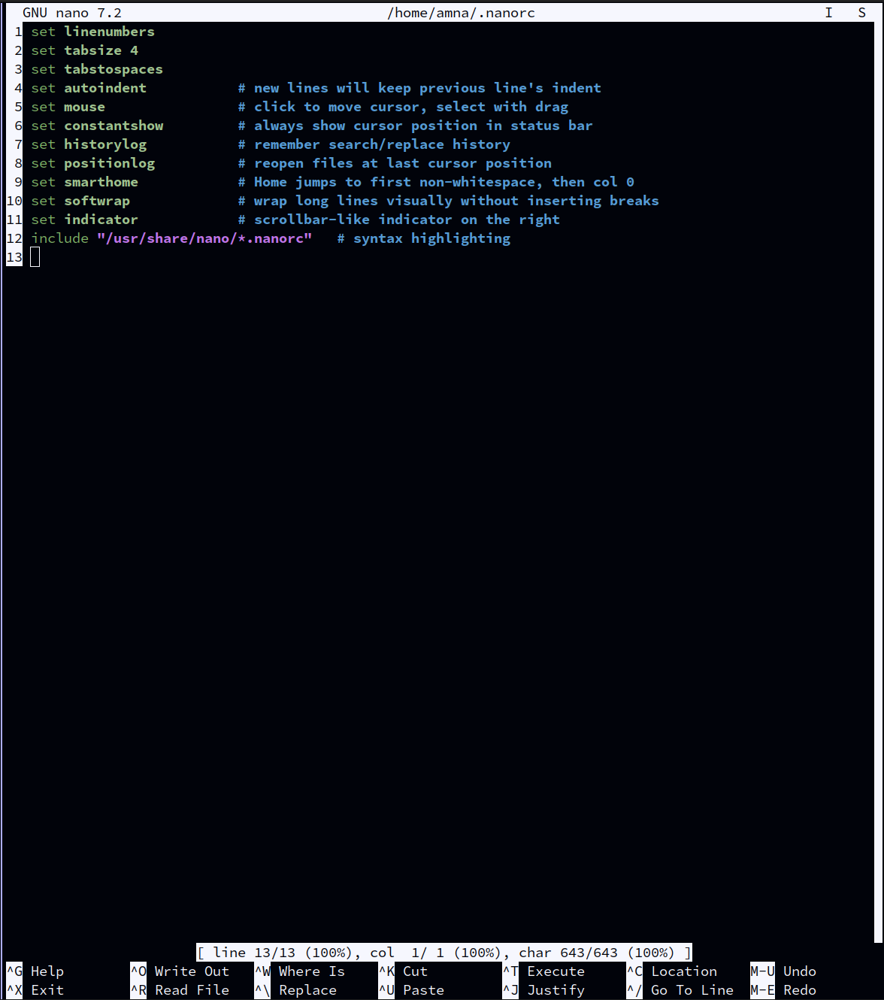
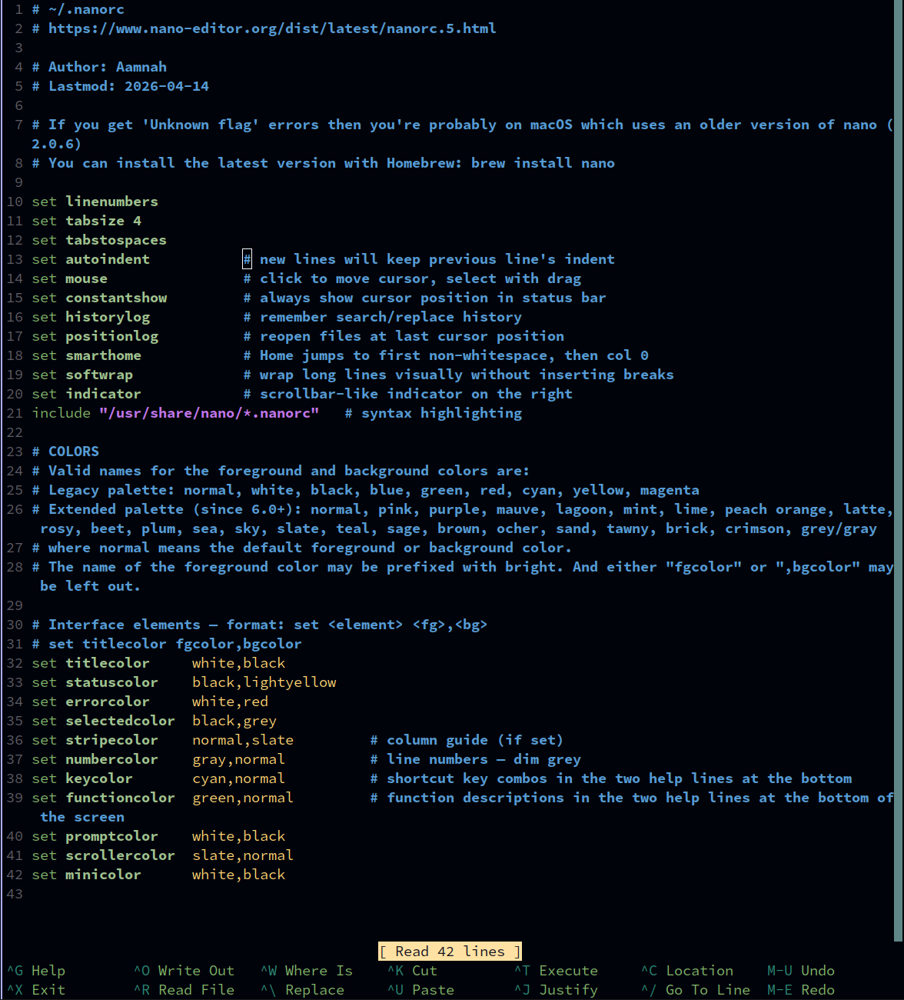

## .Files

These files are an accumulation of bash and zsh aliases, shortcuts and functions that i have collected over the years.

Cross-platform: aliases that wrap commands with Linux/macOS differences (GNU vs BSD flags, trash paths, DNS flush, screen lock) detect the OS at source-time and pick the right invocation. Same alias name on both platforms, the right command behind it.


## Install

Clone and run:

```sh
git clone https://github.com/aamnah/dotfiles && cd dotfiles && ./install.sh
```

Or run remotely without cloning (fetches each file from `raw.githubusercontent.com`):

```sh
curl -fsSL https://raw.githubusercontent.com/aamnah/dotfiles/master/install.sh | bash -s -- --remote
```

`install.sh` backs up any existing target as `<file>.bak.<timestamp>` before overwriting, and installs starship if it's missing. It does **not** change your login shell — see the Shell section below for `chsh`.


## Shell

The repo supports both **bash** and **zsh** with feature parity in mind — pick whichever shell you prefer on a given machine. Both sets of startup files are tracked, and `install.sh` deploys both regardless of which shell is currently active, so switching shells on a box doesn't require re-running anything.

zsh is the default shell on **macOS** (since Catalina, 2019) and **Kali Linux**. On most other systems — **Ubuntu**, **Debian**, **Fedora**, **Arch**, **Alpine**, and the standard Docker base images — bash (or `sh`) is the default and zsh has to be installed explicitly:

```sh
# Debian/Ubuntu
sudo apt install zsh
# Fedora/RHEL: sudo dnf install zsh
# Arch:        sudo pacman -S zsh
# Alpine:      sudo apk add zsh

# Set as login shell (takes effect on next login)
chsh -s "$(which zsh)" "$USER"
```

`install.sh` does not run `chsh` for you — switching login shells is an explicit opt-in.

### Startup files

| zsh | runs when | bash equivalent | what to put here |
|---|---|---|---|
| `.zshenv` | **every** zsh invocation — interactive, login, scripts, cron, GUI launches | (no real equivalent) | `PATH` and env vars that everything needs to see |
| `.zprofile` | login shells only, **before** `.zshrc` | `.bash_profile` | login-once setup (e.g. `ssh-agent` autostart, tmux auto-attach) |
| `.zshrc` | interactive shells (every new tab) | `.bashrc` | aliases, functions, prompt, completion, keybindings |
| `.zlogin` | login shells, **after** `.zshrc` | (`.bash_login`, rare) | login-once setup that needs the shell already configured |
| `.zlogout` | on logout from a login shell | `.bash_logout` | cleanup on exit |

In practice most personal config can live in `.zshrc` without issue. The split matters when:

- **Something must run only once per session** — the canonical example is `ssh-agent`. Put it in `.zshrc` and every new terminal tab spawns a fresh agent; put it in `.zprofile` and every tab/subshell inherits the same `SSH_AUTH_SOCK`.
- **Something must be visible to non-interactive contexts** — cron jobs, GUI-launched apps, and scripts only source `.zshenv`. PATH belongs there for that reason.

bash collapses this distinction more aggressively: `.bash_profile` is the login file, `.bashrc` the interactive file, and many setups source the latter from the former so the same content runs in both contexts. There's no `.bash_env` analog — bash has nothing that runs for every invocation including scripts.


## Config files

`.nanorc`

Default nano:


Custom config:


.bash_aliases / .zsh_aliases
---

Shortcuts for directories, programs, system processes and commands. Both files contain the same universal toolset, byte-identical at the source level. The only structural difference is `dang` (uses bash's `history -p` vs zsh's `fc -ln -1` since shell builtins differ).

#### Directories
- `desk` go to Desktop — `cd ~/Desktop`
- `dl` go to Downloads — `cd ~/Downloads`

#### Smart Listings (cross-platform: GNU `--color=` vs BSD `-G`)
- `ll` List all (-a) files and directories in a detailed (-l), human readable (-h), color coded way with a trailing slash (-F)
- `ls` Coloured short listing — `ls -hF` + colour
- `l` Coloured line-based listing instead of columns — `ls -aFx` + colour
- `lsd` Only list directories, including hidden ones — `ls -dl */ .[^.]*/`
- `la` List all (incl. hidden) — `ls -A`
- `tree` Always list the tree command in color coding — `tree -C`

#### Search
- `grep`, `egrep`, `fgrep` Always coloured — `--color=always`

#### Tools
- `c` Shortcut for `claude`
- `kkk` Kill the current tmux session — `tmux kill-session`

#### IPs
- `myip` Show public IP via curl — `curl ifconfig.me`
- `ip` Show public IP via OpenDNS — `dig +short myip.opendns.com @resolver1.opendns.com`
- `localip` Show local IP — `ipconfig getifaddr en0` (macOS) / `hostname -I` (Linux)

#### Misc.
- `emptytrash` Empty the Trash on all mounted volumes and the main HDD — `/Volumes/*/.Trashes` + `~/.Trash` (macOS) / `~/.local/share/Trash/` (Linux, XDG spec)
- `cleanup` Recursively delete `.DS_Store` files — `find . -type f -name '*.DS_Store' -delete`
- `chromekill` Kill all the tabs in Chrome to free up memory (preserves extensions). Cross-platform regex matches both `Chrome Helper` (macOS) and `chrome` (Linux)
- `afk` Lock the screen (when going AFK) — `CGSession -suspend` (macOS) / `loginctl lock-session` → `xdg-screensaver lock` (Linux)
- `reload` Reload the shell (i.e. invoke as a login shell) — `exec $SHELL -l`

#### Sudo
- `dang` repeat the last command with sudo, basically `sudo !!` equivalent

#### Disk Usage
- `ducks` List top ten largest files/directories in current directory, human-readable — `du -chs * | sort -rh | head -11`
- `ds` Find the biggest in a folder — `du -ks * | sort -n`

#### Memory
- `wotgobblemem` What's gobbling the memory? — `ps` sorted by memory %, top 15

#### DNS
- `flushdns` Flush DNS cache — `dscacheutil -flushcache` + `killall -HUP mDNSResponder` (macOS) / `resolvectl flush-caches` chain (Linux)

#### Security
- `netlisteners` Show active network listeners — `lsof -i -P | grep LISTEN`

#### What's *not* in the repo
Personal/machine-specific aliases (project dirs, SSH host shortcuts, school course dirs) live in your local `~/.zsh_aliases` only — they reference paths and hosts that don't exist on a fresh machine, so they're not committed.


### bash

.bash_profile

- `PS1` - Prompt shows only current working directory `\w` and `\$`. Newline at both beginning and end makes differentiating command output easier
- Prompt uses [starship](https://starship.rs) when available, falling back to the manual git-aware `PS1` on minimal boxes (VPS, Docker images) where starship isn't installed.

### custom prompt with Starship

Cross-shell prompt configured by `.config/starship.toml`. Same config drives bash and zsh, so the prompt looks identical in both. Two-line layout adapted from Kali Linux's default zsh prompt:

    ┌──[~/path] (branch) status
    └─$

- `┌──[`, `]`, `└─` — green
- path and `$` — blue
- `$` flips to red on non-zero exit (visual feedback for the last command)
- git branch + status modules render after the path when in a repo

`install.sh` installs the starship binary if it's missing — `brew install starship` on macOS, the official installer (`curl -sS https://starship.rs/install.sh | sh`) elsewhere — then drops `starship.toml` into `~/.config/`. To install manually:

```sh
# binary
curl -sS https://starship.rs/install.sh | sh

# activate (one line per shell rc)
echo 'eval "$(starship init bash)"' >> ~/.bash_profile
echo 'eval "$(starship init zsh)"'  >> ~/.zshrc
```

## .bash_functions

- `take()` create a dir and cd to it by taking a name
- `extract()` Extract most know archives with one command
- `ii()` display useful host related informaton
- `getwebsite()` wget a whole website
- `spy()` identify and search for active network connections
- `sniff()` sniff GET and POST traffic over http v2
- `bell()` Ring the system bell after finishing a script/compile

## .zsh_functions

- `t()` — load a `tmuxp.yaml` layout from the current dir, falling back to `~/.tmuxp/default.yaml`, falling back to a plain `tmux new` session named after the cwd. Auto-injects `session_name` and `start_directory` if the config lacks them.

## .config/

Editor and terminal configs that live under XDG-style paths:

- `.config/kitty/kitty.conf` — kitty terminal config
- `.config/nvim/init.lua` — Neovim config (tabs/indents, line numbers)
- `.config/starship.toml` — Starship prompt (see above)

## Resources

- Take a look at [Command Line Fu](http://www.commandlinefu.com/commands/browse/sort-by-votes) for some really cool commands
